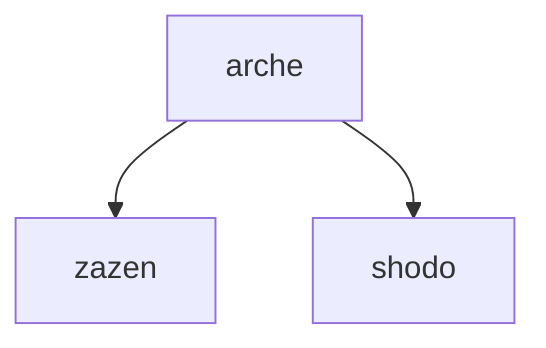
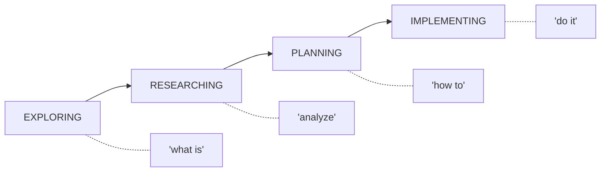

# Arché

[](https://opensource.org/licenses/MIT)

> Essential principles for LLM behavior, designed as a Claude Code plugin.

## What is Arché?

**Arché** (ἀρχή) is an ancient Greek word meaning "origin", "first principle", or "foundation". The pre-Socratic philosophers used it to describe the fundamental substance or principle from which everything else derives.

Arché provides the **essential principles** that govern LLM behavior - the foundational axioms that must be loaded before any work begins.

## Installation

```bash
bash -c "$(curl -fsSL https://raw.githubusercontent.com/daviguides/arche/main/install.sh)"
```

## Manifesto

Read the **[Manifesto](manifesto.md)** for a detailed explanation of the workflow philosophy: spec-as-code, phased cognitive work, and why human-in-the-loop matters.

## Philosophy

### The First Principle (ἀρχή)

Just as the Greek philosophers sought the arché of the universe - the fundamental principle underlying all things - this plugin defines the arché of LLM behavior: the inviolable principles that shape how Claude Code operates.

> *"The arché is that from which all things come to be, and into which they are finally resolved."*
> — Aristotle, on the pre-Socratics

### The Seven Essential Principles

| Principle | Greek Virtue | Purpose |
|-----------|--------------|---------|
| **Principle Enforcement** | Nomos (law) | Mandatory gates; research before action |
| **Correction-Integration** | Metanoia (turning of mind) | A user correction overrides the pattern, permanently |
| **Anti-Duplication** | Aletheia (truth) | Single source of truth; reference, don't repeat |
| **Anti-Precocity** | Kairos (right timing) | Respect the user's current mode |
| **Anti-Complacency** | Akribeia (exactness) | DONE is the requirement, not the easy path |
| **Anti-Babysitting** | Autarkeia (self-sufficiency) | Execute to completion; never stop mid-task |
| **LLM Conciseness** | Sophrosyne (moderation) | Maximum signal, minimum noise |

### Hierarchy of Principles

```
┌─────────────────────────────────────────┐
│ 1. Principle Enforcement (Meta)         │  ← Governs all others
├─────────────────────────────────────────┤
│ 2. Correction-Integration               │  ← User correction overrides habit
├─────────────────────────────────────────┤
│ 3. Anti-Duplication                     │  ← SSOT
├─────────────────────────────────────────┤
│ 4. Anti-Precocity                       │  ← Respect user's mode
├─────────────────────────────────────────┤
│ 5. Anti-Complacency                     │  ← DONE means the requirement
├─────────────────────────────────────────┤
│ 6. Anti-Babysitting                     │  ← Autonomous execution
├─────────────────────────────────────────┤
│ 7. LLM Conciseness                      │  ← Token economy
└─────────────────────────────────────────┘
```

## Relationship with Other Plugins

Arche is the foundation upon which other plugins build:

| Plugin | Philosophy | Depends on Arché |
|--------|------------|------------------|
| **arche** | Greek (ἀρχή) | — (is the foundation) |
| [**zazen**](https://github.com/daviguides/zazen) | Zen (座禅) | Zen principles for code clarity |
| [**shodo**](https://github.com/daviguides/shodo) | Calligraphy (書道) | Python standards for elegant code |



## Principles

### Correction-Integration

**A correction overrides the pattern**: A user correction is a hard constraint carried forward, never a preference, never a one-time patch.

- No dilution ("MLX preferred but torch acceptable" after MLX was demanded)
- No superficial acknowledgment ("you're right" then the old behavior)
- Propagate corrections UNDILUTED into delegated work

### Anti-Duplication

**Single Source of Truth (SSOT)**: Every piece of information exists in exactly one authoritative location.

- Reference, don't repeat
- If it exists, extend it
- No "Related" sections (load workflows handle connections)

### Anti-Complacency

**DONE is the requirement, not the easy path**: Never declare completion on a downgraded, deferred, or unverified deliverable.

- No silent downgrade; surface substitutions for approval
- No deferral-as-done ("X is future work" while reporting success)
- When blocked, the exact blocker IS the deliverable

### Anti-Babysitting

**Execute to completion**: Once in IMPLEMENTING mode with a TODO list, never stop until `TODO_COUNT(pending) == 0`.

- No premature check-ins
- No mid-execution validation requests
- Mark issues, don't stop for them

### LLM Conciseness

**Maximum signal, minimum noise**: Every token must carry semantic value.

- Eliminate filler words
- Active voice, imperative mood
- Code > prose; show, don't tell

### Principle Enforcement

**Research before implementation**: Mandatory gates before any action.

- Load principles before working
- Search codebase before creating
- Detect user's mode before responding

## Essential Cognitive Modes

The 4 principal modes that define the user's journey from discovery to delivery:



| Mode | User Intent | Signals |
|------|-------------|---------|
| **EXPLORING** | Discover what exists | "What is...", "Show me...", "Where is..." |
| **RESEARCHING** | Deep analysis | "Analyze...", "Compare...", "Why does..." |
| **PLANNING** | Design solution | "How should we...", "Plan out...", "Best approach..." |
| **IMPLEMENTING** | Execute changes | "Do it", "Create...", "Fix...", "Go ahead" |

**Each transition requires explicit user signal.** Never assume the user wants to move forward.

## Project Structure

```
arche/
├── spec/                    # Normative specifications
│   └── principles/          # The four essential principles
├── context/                 # Applied examples
│   └── guides/              # How to apply principles
├── prompts/                 # Workflow orchestrators
│   └── load.md              # Load all principles
├── commands/                # User-facing commands
└── agents/                  # Specialized agents
```

## Usage

```bash
/arche:load                  # Load all essential principles
```

## License

MIT License

## Author

Essential principles for Claude Code behavior.

---

> *"Know the first principle, and all else follows."*
> — Ancient Greek wisdom
